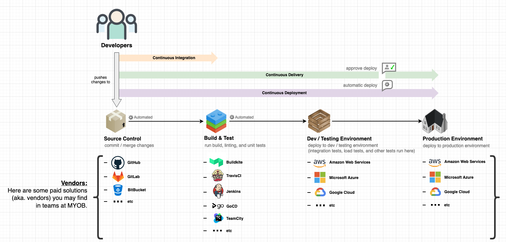
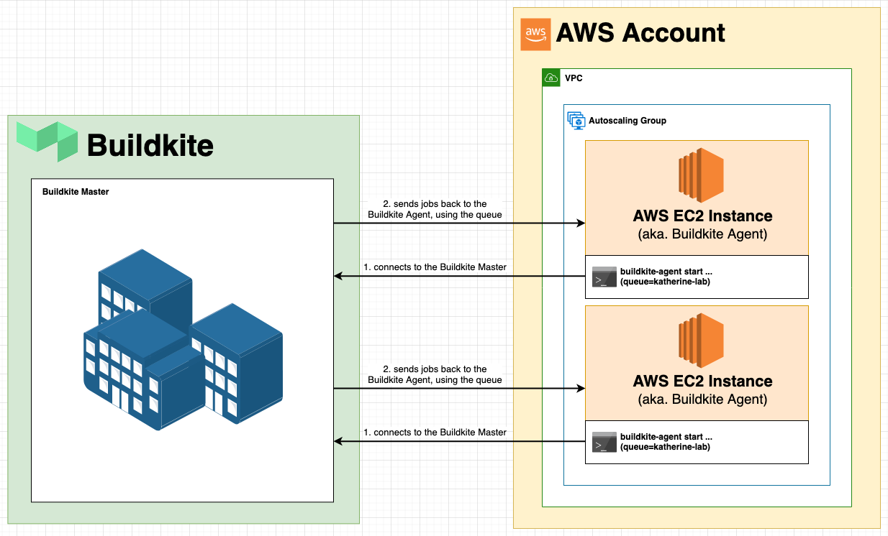

# Continuous Integration / Continuous Delivery / Continuous Deployment

## What is Continuous Integration (aka. CI)

`Continuous Integration` is a practice where developers regularly merge their code changes back into their source code repository, after which automated builds and tests are run to verify the quality of the changes.

## What is Continuous Delivery / Continuous Deployment (aka. CD)

`Continuous Delivery` is an extension of CI, where developers automate the process for pushing changes directly to production. On top of having automated builds and testing from CI, `Continuous Delivery` aims for developers to have the release process for a product or service automated. However, the timing of when to push it to production is a business decision, so the final deployment is a manual step that triggers an automated process to get the changes to production.

`Continuous Deployment` is virtually identical to `Continuous Delivery`, except there is no manual process when it come to the release to production. The entire process from commit to release is completely automated, so any working valid change goes all the way to production.

Considering `Continuous Delivery` & `Continuous Deployment` are so closely related, the nickname for the entire process is often known as **CI/CD**.

## CI/CD Visualized

Below is a visualization of a basic CI/CD pipeline at MYOB:



### Common CI/CD solutions across MYOB
(aka. vendors)

* [Buildkite (our sensible default)](https://buildkite.com/)
* [GitHub Actions](https://github.com/features/actions)
* [GitLab CI](https://about.gitlab.com/stages-devops-lifecycle/)
* [Jenkins](https://jenkins.io/)
* [GoCD](https://www.gocd.org/)
* [TeamCity](https://www.jetbrains.com/teamcity/)
* [Bamboo](https://www.atlassian.com/software/bamboo)
* [TravisCI](https://travis-ci.org/)
* plus more..

Some of these vendors are paid solutions, and some offer free services you could use in your projects.
* For example, everyone with a GitHub account has access to `2000` minutes per month of using `GitHub Actions`. If you're playing around with a project outside of MYOB that could use CI/CD, consider giving that a try.

## Why use CI/CD?

1. **Automated testing occurs for every change.**
    * You'll encounter less "it works on my machine" issues because you have tests automatically running in a consistent way. No longer will you forget to run tests locally with your new changes!

1. **Increased code coverage.**
    * You can setup your CI/CD pipeline to check your test coverage, where every change will provide visibility on how much higher or lower you test coverage is.

1. **Deploy your code to production with confidence.**
    * Every change is tested to determine quality and "correctness" before being deployed to production, which allows you to be confident your changes are working as expected.

1. **You're focused on features for your product or service, rather than how to get changes to your customers.**
    * Through using a CI/CD pipeline, you're no longer waiting for a script or process to be finished locally before you can commit your changes. Push and be notified whether it passed or failed instead!

1. **Parallelization in CI/CD allows you to build faster.**
    * You're able to split your build processes and tests across multiple machines, making your feedback loop faster.

1. **Make quality decisions around merging faster.**
    * You can communicate between your CI/CD vendor (eg. Buildkite) and source control management platform (eg. GitHub) to notify developers of failing tests before any changes are merged.

1. **By automating how your product or service is released to customers, you essentially have a runbook of how to deploy your product or service manually.**
    * This is very useful for catching up joining team members on how a product or service runs / is released to customers.


## Buildkite

Buildkite is the sensible default CI/CD solution at MYOB, managed by the domain [Developer Experience (aka. DLX)](https://myob.slack.com/archives/C5UTN25MW).

* [See their documentation on how to get started using Buildkite](https://hello.hub.myob.com/auto/buildkite.html). 
> Note, you'll need to be connected to the MYOB VPN or connected to the internet in-office to view them.

Below is also a basic outline of what is Buildkite and how you can start using it in your projects now.

### How does Buildkite work at a high level?

Buildkite (the company) have created Buildkite (the software-as-a-service) for anyone to implement CI/CD with their own products or services. Essentially, Buildkite (the company) manages something called the `Buildkite HQ`. Customers of Buildkite need to create things called `Buildkite Agents` to connect to the `Buildkite HQ`, which are created and managed by the [DLX](https://myob.slack.com/archives/C5UTN25MW) domain for the teams at MYOB. These `Buildkite Agents` are essentially machines, typically in the cloud (aka. AWS), that developers can use to implement CI/CD for their projects.

Specifically, these [DLX](https://myob.slack.com/archives/C5UTN25MW) managed Buildkite Agents are AWS EC2 instances running in a teams AWS account that connect to the `Buildkite HQ` via a CLI tool Buildkite (the company) provides called `buildkite-agent`. Below is a very *HIGH-LEVEL* depiction of what this looks like in running in an AWS account:



When connecting to the `Buildkite HQ`, a `Buildkite Agent` must specify a `queue` to use. The `queue` is used by the `Buildkite HQ` to identify and target one-or-many `Buildkite Agents` when running CI/CD automations. Since a `queue` maps to one-or-many `Buildkite Agents`, developers can use a `queue` to target a very specific set of  `Buildkite Agents`. In MYOB's case, DLX have setup their `Buildkite Agents` with a `queue` at the AWS account level, so developers are essentially using a `queue` to mean "which AWS account should I run this CI/CD automation in?"

> If you're unsure of which queue to use for your project, feel free to reach out to DLX in [#d-devex](https://myob.slack.com/archives/C5UTN25MW).

### How do I use Buildkite with my project?

Buildkite uses pipelines to run CI/CD automations for projects. Essentially, you need to setup one of these pipelines for your project when using Buildkite. [Buildkite has some documentation on pipelines here.](https://buildkite.com/docs/pipelines)

[DLX](https://myob.slack.com/archives/C5UTN25MW) have provided a tool for developers to use to create pipelines called `pipe`. [See their documentation on how to install it / create a pipeline for your project](https://hello.hub.myob.com/auto/buildkite.html#installing-pipe). This provides the connection from your GitHub repository to trigger your Buildkite pipeline when you push changes. 

> If you have any issues installing or using `pipe`, reach out to DLX in [#d-devex](https://myob.slack.com/archives/C5UTN25MW) on Slack.

When running a build on a `Buildkite Agent`, by default, a `Buildkite Agent` looks for a file called either `pipeline.yml`, `buildkite.yml`, or `.buildkite/pipeline.yml` in the root of your project. This file outlines the CI/CD automations you want to automatically run for your project, where the pipeline is stored as-code with your project.

A basic `pipeline.yml` is:

```yml
---
steps:

    - label: "hello world :wave:"
      command: echo "hello world"
      agent:
        queue: katherine-lab
```
This `pipeline.yml` outlines a basic pipeline that implements a `command step` to-be-run on a `Buildkite Agent`, which will be run in the AWS account matching the `katherine-lab` queue.

There are a few different types of steps that can be implemented in a `pipeline.yml`. Some examples, with links to their documentation, are:

* [`Command Step`](https://buildkite.com/docs/pipelines/command-step)
* [`Wait Step`](https://buildkite.com/docs/pipelines/wait-step)
* [`Block Step`](https://buildkite.com/docs/pipelines/block-step)
* \+ more ...


### Where to from here?

Try and implement CI/CD into one of your projects using a combination the [Buildkite documentation](https://buildkite.com/docs/pipelines/defining-steps) and assistance from your mentor(s).

If you have any questions around CI/CD in general, feel free to reach out to DLX in the [#d-devex](https://myob.slack.com/archives/C5UTN25MW) Slack channel directly. They can assist you with pairing and guidance tailored specific to your project.

For questions around deploying to Jupiter, in general, or via CI/CD, feel free to reach out to the team in the [#svc-jupiter](https://myob.slack.com/archives/C5VLNTMFF) Slack channel using `@jupiter-shield` in your message. [They provide some documentation about Jupiter here](https://docs.jupiter.myob.com/), which you'll need to be on the MYOB VPN, or connected to the internet in an office to view.

Lastly, for questions around "how do I make my product or service more observable" (i.e via logging, tracing, or metrics) ask the Observability team over in the [#t-observability]() Slack channel. They can provide support with things like logging, tracing, and metrics for your products or services, as well as provide training into these things.

And if you're unsure if any of these channels are right for you to ask for help, ask `@router` in [#oa-support](https://myob.slack.com/archives/C3F2M5NFP). This is a Slack used by developers to ask general operation questions, which are then filtered to the appropriate team to respond. Ask anything your'e unsure about there!

## Further Resources

Below are some further resources around CI/CD.

**Blogs:**
* [Agile Alliance - Continuous Integration](https://www.agilealliance.org/glossary/continuous-integrationhttp://)
* [Agile Alliance - Continuous Deployment](https://www.agilealliance.org/glossary/continuous-deployment)
* [Agile Alliance - Lead Time](https://www.agilealliance.org/glossary/lead-time)
* [Puppet - Continuous Delivery Vs. Continuous Deployment](https://puppet.com/blog/continuous-delivery-vs-continuous-deployment-what-s-diff)
* [Atlassian - CI vs CI vs CD](https://www.atlassian.com/continuous-delivery/ci-vs-ci-vs-cd)
* [Thoughtworks - Continuous Integration](https://www.thoughtworks.com/continuous-integration)

**Books:**
* Continuous Delivery Reliable Software Releases Through Build, Test, And Deployment Automation by Jez Humble and David Farley ([more info](https://martinfowler.com/books/continuousDelivery.html))
